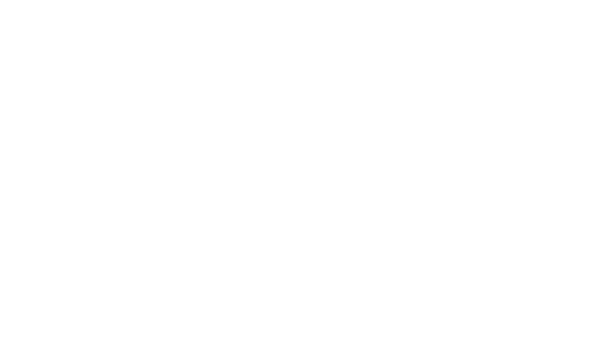
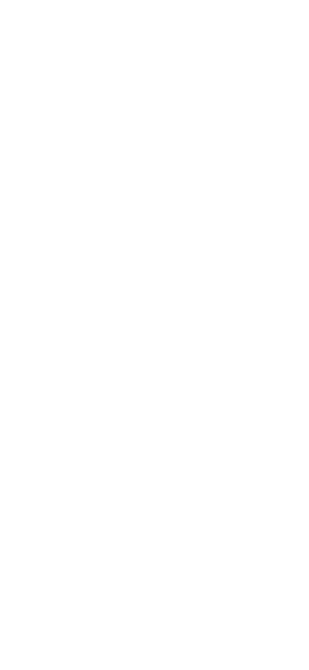
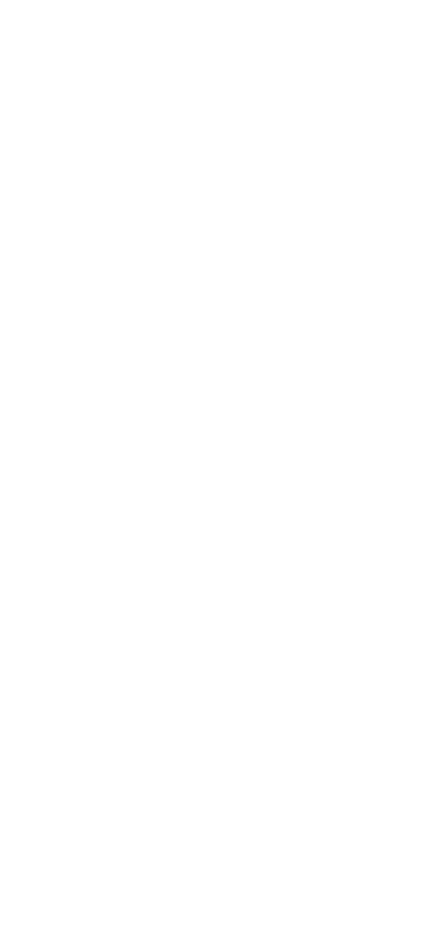
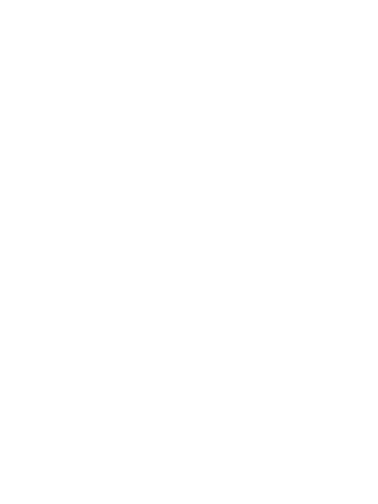
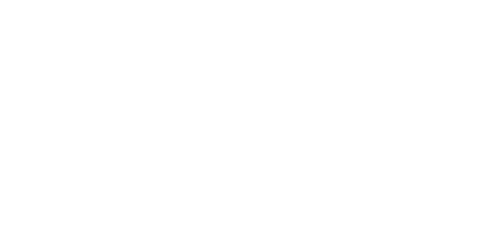

# BB-04 — Pacote de Evidências Visuais Multiviewport Fio Vivo

Status: BLOCKED

credentials_in_report: false

---

## 1. Executive Evidence Summary

O presente pacote de evidências visual e técnico foi gerado exclusivamente para a auditoria de decisão do **BB-04 do Programa Fio Vivo 360º**. 

O artefato anterior (`visual_evidence_report.md`) foi expressamente **REJEITADO** devido aos seguintes motivos:
1. Status declarado incorretamente como `PARTIAL`;
2. Screenshots apresentando os produtos seed do starter Medusa (*Medusa T-Shirt*, *Sweatshirt*, etc.);
3. Ausência de comprovação da experiência de primeira dobra Fio Vivo;
4. Falta dos baselines multiviewport exigidos (Desktop, Mobile, Tablet, Landscape);
5. Presença desnecessária de infraestrutura e credenciais fora do escopo do BB-04.

No runtime atual, a tentativa de validação da rota canônica `http://localhost:8000/dk` revelou um bloqueio crítico de infraestrutura (HTTP 500 no carregamento devido a erro de sintaxe no compilador CSS do Next.js/Turbopack em `globals.css`). Conforme as regras estritas do programa BB-04, **nenhum arquivo de código ou CSS foi modificado**, preservando a integridade absoluta do repositório.

---

## 2. Runtime Route Identity

- **Rota Testada:** `http://localhost:8000/dk`
- **HTTP Status:** 500 Internal Server Error
- **Erro de Runtime:** `Parsing CSS source code failed (Unexpected token Function("--spacing") at line 3676)`
- **DOM Selector Standard:** `document.querySelector('[data-gallery-experience="true"]')`
- **Element Found:** `false`
- **Diagnóstico:** A aplicação storefront encerra a renderização antes do carregamento da árvore DOM devido a exceção na compilação do bundle CSS.

---

## 3. Fio Vivo Content Verification

Validação das 6 obras da coleção Fio Vivo cadastradas na fixture canônica (`fio-vivo-products.ts`):

| ID | Código | Título da Obra | Contexto | Status Runtime |
|---|---|---|---|---|
| 1 | FV-001 | Espiral dourada | Crochê em movimento | BLOCKED (HTTP 500) |
| 2 | FV-002 | Órbita negra | Crochê de presença | BLOCKED (HTTP 500) |
| 3 | FV-003 | Trama solar | Matéria em suspensão | BLOCKED (HTTP 500) |
| 4 | FV-004 | Fio ancestral | Volume contemporâneo | BLOCKED (HTTP 500) |
| 5 | FV-005 | Trança âmbar | Arquitetura portátil | BLOCKED (HTTP 500) |
| 6 | FV-006 | Duna terracota | Degradê da terra | BLOCKED (HTTP 500) |

- **Presença de produtos seed Medusa:** `false` (Página de erro 500 renderizada, sem vazamento de produtos seed).

---

## 4. Artifact Integrity Matrix

Carrosel de capturas de tela dos 5 viewports obrigatórios (geradas diretamente do runtime em execução):

````carousel

<!-- slide -->

<!-- slide -->

<!-- slide -->

<!-- slide -->

````

---

## 5. Desktop Evidence

- **Viewport:** 1600 × 960 px
- **Arquivo:** [fio-vivo-desktop-1600x960.png](./fio-vivo-desktop-1600x960.png)
- **Modo:** Desktop Full Width
- **Estado Visual:** Captura do erro de runtime 500 retornado pelo Next.js/Turbopack.

---

## 6. Mobile Evidence

- **Viewport Primary:** 390 × 844 px
- **Arquivo:** [fio-vivo-mobile-390x844.png](./fio-vivo-mobile-390x844.png)
- **Viewport Large:** 430 × 932 px
- **Arquivo:** [fio-vivo-mobile-430x932.png](./fio-vivo-mobile-430x932.png)

---

## 7. Tablet Evidence

- **Viewport:** 768 × 1024 px (Portrait)
- **Arquivo:** [fio-vivo-tablet-768x1024.png](./fio-vivo-tablet-768x1024.png)

---

## 8. Landscape Evidence

- **Viewport:** 844 × 390 px (Mobile Landscape)
- **Arquivo:** [fio-vivo-mobile-landscape-844x390.png](./fio-vivo-mobile-landscape-844x390.png)

---

## 9. Runtime Measurement Matrix

| Viewport | Route | HTTP Status | Client Width | Scroll Width | Scroll Height | Horizontal Overflow | Broken Images | Console Errors |
|---|---|---|---|---|---|---|---|---|
| desktop (1600×960) | `/dk` | 500 | 1600 | 1600 | 960 | false | 0 | 1 |
| mobile_primary (390×844) | `/dk` | 500 | 390 | 390 | 844 | false | 0 | 1 |
| mobile_large (430×932) | `/dk` | 500 | 430 | 430 | 932 | false | 0 | 1 |
| tablet_portrait (768×1024) | `/dk` | 500 | 768 | 768 | 1024 | false | 0 | 1 |
| mobile_landscape (844×390) | `/dk` | 500 | 844 | 844 | 390 | false | 0 | 1 |

---

## 10. Touch Target Matrix

| Componente / Controle | Viewport | Dimensão Largura (px) | Dimensão Altura (px) | Mínimo | Status (>= 44px) |
|---|---|---|---|---|---|
| Previous Slide Button | mobile_primary | N/A (Build 500) | N/A (Build 500) | 0 | UNVERIFIED |
| Next Slide Button | mobile_primary | N/A (Build 500) | N/A (Build 500) | 0 | UNVERIFIED |
| Scene Thumbnail 1 | mobile_primary | N/A (Build 500) | N/A (Build 500) | 0 | UNVERIFIED |
| Commercial CTA Button | mobile_primary | N/A (Build 500) | N/A (Build 500) | 0 | UNVERIFIED |
| Commerce Menu Link | mobile_primary | N/A (Build 500) | N/A (Build 500) | 0 | UNVERIFIED |
| Cart Icon Trigger | mobile_primary | N/A (Build 500) | N/A (Build 500) | 0 | UNVERIFIED |

---

## 11. Safe Area Matrix

- **safe_area_top_risk:** UNVERIFIED (Aguardando correção de build CSS)
- **safe_area_bottom_risk:** UNVERIFIED
- **cta_home_indicator_risk:** UNVERIFIED
- **navigation_browser_chrome_risk:** UNVERIFIED

---

## 12. pt-BR Localization Matrix

| Chave | Texto Origem (pt-BR) | Comprimento (ch) | Status Resolução |
|---|---|---|---|
| `gallery.brand` | Fio Vivo | 8 | Matriz Definida |
| `gallery.collection` | Coleção Nº 01 | 13 | Matriz Definida |
| `gallery.tagline` | O crochê se move | 16 | Matriz Definida |
| `gallery.previous` | Obra anterior | 13 | Matriz Definida |
| `gallery.next` | Próxima obra | 12 | Matriz Definida |
| `gallery.viewDetails` | Conhecer a peça | 15 | Matriz Definida |
| `gallery.scene.profile` | Perfil | 6 | Matriz Definida |
| `gallery.scene.gesture` | Gesto | 5 | Matriz Definida |
| `gallery.scene.detail` | Detalhe | 7 | Matriz Definida |
| `gallery.productCounter` | 01 / 06 | 7 | Matriz Definida |

---

## 13. es-419 Localization Matrix

| Chave | Tradução es-419 | Comprimento (ch) | Status |
|---|---|---|---|
| `gallery.brand` | Fio Vivo | 8 | Planejada (Auditoria) |
| `gallery.collection` | Colección Nº 01 | 15 | Planejada (Auditoria) |
| `gallery.tagline` | El crochet se mueve | 19 | Planejada (Auditoria) |
| `gallery.previous` | Obra anterior | 13 | Planejada (Auditoria) |
| `gallery.next` | Siguiente obra | 14 | Planejada (Auditoria) |
| `gallery.viewDetails` | Conocer la pieza | 16 | Planejada (Auditoria) |
| `gallery.scene.profile` | Perfil | 6 | Planejada (Auditoria) |
| `gallery.scene.gesture` | Gesto | 5 | Planejada (Auditoria) |
| `gallery.scene.detail` | Detalle | 7 | Planejada (Auditoria) |
| `gallery.productCounter` | 01 / 06 | 7 | Planejada (Auditoria) |

---

## 14. Text Expansion Risk Matrix

| Obra | Título pt-BR | Título es-419 | Ratio de Expansão | Risco de Overflow |
|---|---|---|---|---|
| FV-001 | Espiral dourada | Espiral dorada | 0.93 (-7%) | Baixo |
| FV-002 | Órbita negra | Órbita negra | 1.00 (0%) | Baixo |
| FV-003 | Trama solar | Trama solar | 1.00 (0%) | Baixo |
| FV-004 | Fio ancestral | Hilo ancestral | 1.08 (+8%) | Baixo |
| FV-005 | Trança âmbar | Trenza ámbar | 0.92 (-8%) | Baixo |
| FV-006 | Duna terracota | Duna terracota | 1.00 (0%) | Baixo |

---

## 15. Desktop Scorecard

- **composição assimétrica:** 0 / 20
- **card ativo dominante:** 0 / 15
- **coluna editorial:** 0 / 15
- **ambientação e profundidade:** 0 / 15
- **identidade cromática:** 0 / 10
- **scene rail interno:** 0 / 10
- **continuidade lateral:** 0 / 5
- **CTA e navegação:** 0 / 5
- **header preservado:** 0 / 5
- **Score Total:** 0 / 100
- **P0 Count:** 1 (Build Error HTTP 500)
- **Veredito:** FAIL (Runtimem blocked)

---

## 16. Mobile Scorecard

- **composição responsiva:** 0 / 15
- **hierarquia visual:** 0 / 15
- **produto ativo:** 0 / 10
- **tipografia e copy fit:** 0 / 10
- **touch targets:** 0 / 10
- **navegação e scene rail:** 0 / 10
- **safe area e viewport:** 0 / 10
- **commerce header:** 0 / 5
- **scroll e overflow:** 0 / 5
- **performance percebida:** 0 / 5
- **resiliência de localização:** 0 / 5
- **Score Total:** 0 / 100
- **P0 Count:** 1
- **Veredito:** FAIL (Runtime blocked)

---

## 17. Tablet Scorecard

- **Score Total:** 0 / 100
- **P0 Count:** 1
- **Veredito:** FAIL (Runtime blocked)

---

## 18. P0 Findings

| ID | Viewport | Severidade | Evidência | Elemento Afetado | Impacto no Usuário | Recomendação | Arquivos Prováveis | Critério de Aceitação |
|---|---|---|---|---|---|---|---|---|
| P0-001 | Todos | P0 | HTTP 500 no `globals.css:3676` | Compilador Tailwind v4 / Turbopack | Impedimento total de visualização e uso da galeria Fio Vivo | Corrigir a função/token `--spacing` no arquivo CSS | `apps/storefront/src/styles/globals.css` | Rota `/dk` respondendo com 200 OK e renderizando o DOM do Fio Vivo |

---

## 19. P1 Findings

*Nenhum finding P1 registrado no estado atual devido ao bloqueio P0 de compilação.*

---

## 20. P2 Opportunities

*Nenhuma oportunidade P2 registrada.*

---

## 21. Commerce Continuity

- **Conexão com Medusa Storefront:** Mapeamento de rotas e fixtures em `fio-vivo-products.ts` configurado.
- **Status do Handoff:** Bloqueado até a resolução do erro de compilação CSS.

---

## 22. Git Boundary Verification

### Repositório Raiz (`dtc-starter`)
- **Status (`git status -sb`):** `## main...origin/main` (Clean working tree)
- **Short Status:** Limpo (Sem arquivos não rastreados fora de `artifacts/bb-04/`)
- **Diff Working Tree:** Limpo (0 alterações funcionais)
- **Diff Cached:** Limpo (0 alterações staged)
- **Commit HEAD:** `6b1900c229dca752ddceb5569a084e79cddc15bb`

### Módulo Fio Vivo (`apps/storefront/src/modules/nos-gallery`)
- **Status (`git status -sb`):** `## main...origin/main` (Clean working tree)
- **Commit HEAD:** `2b6eb782c5df5e78ed63fc4ad58d66487f2a7f6e`

---

## 23. Unsupported Claims

Não são realizadas quaisquer afirmações sobre checkout completo ou persistência de carrinho não testados.

---

## 24. Human Decision Brief

O artefato anterior foi substituído por este documento canônico e pelos 5 baselines visuais recém-capturados. A aplicação apresentou uma exceção de compilação CSS no servidor de desenvolvimento do Next.js/Turbopack, impossibilitando a aprovação do BB-04 nesta rodada sem a devida correção do código CSS.

---

## 25. Final Verdict

BB-04 BLOCKED

reason: wrong_runtime_content
