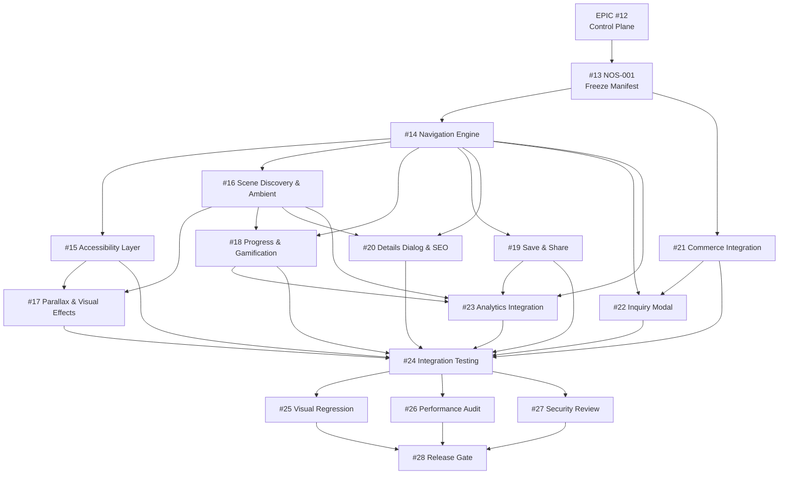

# 13 — Dependency DAG (NOS-001)

**Issue:** #13 (NOS-001)
**Protocol:** Canonical Autonomous Execution v4.0

> Directed Acyclic Graph of child issues #13–#28. GO is NOT inherited across the DAG — each issue must earn its own DoR PASS before execution.

---

## 1. Graph (Mermaid)



---

## 2. Dependency Table

| Issue | Depends On (Predecessors) | Successors | Critical Path? |
|---|---|---|---|
| #13 | (none — root) | #14, #21 | YES |
| #14 | #13 | #15, #16, #18, #19, #20, #22, #23 | YES |
| #15 | #14 | #17, #24 | NO |
| #16 | #14 | #17, #18, #20, #23 | YES |
| #17 | #15, #16 | #24 | NO |
| #18 | #14, #16 | #23, #24 | NO |
| #19 | #14 | #23, #24 | NO |
| #20 | #14, #16 | #24 | NO |
| #21 | #13 | #22, #24 | YES (commerce lane) |
| #22 | #14, #21 | #24 | NO |
| #23 | #14, #16, #18, #19 | #24 | NO |
| #24 | #15, #17, #18, #19, #20, #21, #22, #23 | #25, #26, #27 | YES |
| #25 | #24 | #28 | NO |
| #26 | #24 | #28 | NO |
| #27 | #24 | #28 | NO |
| #28 | #24, #25, #26, #27 | (terminal) | YES |

---

## 3. Critical Path

```
#13 → #14 → #16 → #24 → #28
```

**Length:** 5 nodes (minimum depth from root to terminal)

**Secondary critical path (commerce lane):**
```
#13 → #21 → #24 → #28
```

---

## 4. Parallel Execution Lanes

| Lane | Issues | Can Start When |
|---|---|---|
| Navigation lane | #14 → #15 → #17 | #13 PASS |
| Scene lane | #14 → #16 → #18, #20 | #14 PASS |
| Interaction lane | #14 → #19 | #14 PASS |
| Commerce lane | #13 → #21 → #22 | #13 PASS |
| Analytics lane | #14 → #23 (needs #16, #18, #19) | #19 PASS |
| Quality lane | #24 → #25, #26, #27 → #28 | #24 PASS |

**Maximum parallelism:** After #14 PASS, issues #15, #16, #18, #19, #20, #22 can all execute in parallel (6 parallel lanes). After #24 PASS, #25, #26, #27 run in parallel (3 lanes).

---

## 5. Gate Propagation Rules

1. **GO is NOT inherited.** #13 GO_FOR_ANALYSIS does NOT make #14 GO. Each issue must pass its own DoR.
2. **Predecessor must be DONE (DoD PASS) before successor can enter DoR.** #14 cannot start DoR until #13 DoD is PASS.
3. **NOS-001 (#13) is the root.** It has no predecessors. Its DoR was already PASS (13/13).
4. **#28 requires ALL predecessors DONE plus human approval.** No automated GO.
5. **Conditional GO** is possible if non-critical dependencies are deferred with documented rationale.

---

## 6. Reconciliation Notes

- **#20 depends on #16** (not just #14): Details dialog needs scene discovery to show scene data.
- **#24 depends on #15 + #17** (not just #14): Integration testing needs accessibility and parallax.
- **#25 depends on #24** (not #20): Visual regression needs integrated gallery.
- **#22 depends on #14 + #21**: Inquiry needs navigation (to know which artwork) and commerce (for product reference).
- **#23 depends on #14 + #16 + #18 + #19**: Analytics needs navigation events, scene events, progress events, save/share events.

---

**End of artifact 13.**