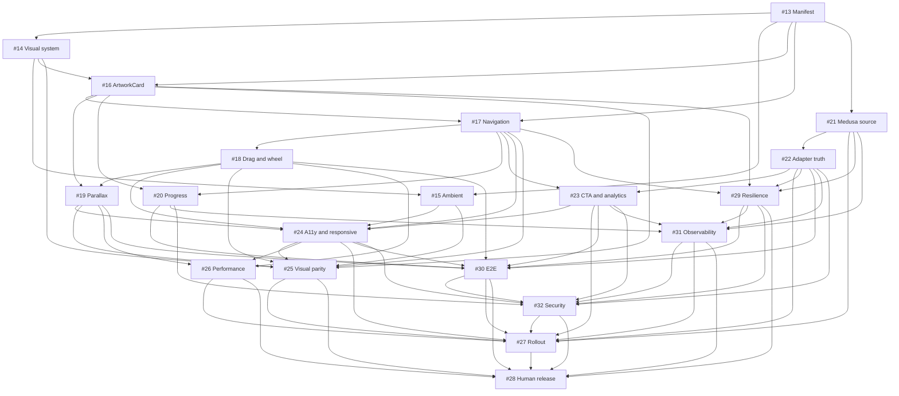

# 13 — Dependency DAG (NOS-001, Remediated)

**Issue:** #13 (NOS-001)  
**Protocol:** Canonical Autonomous Execution v4.0  
**Status:** Auto-Improve Iteration 1  
**Hard-scheduling SSOT:** literal `Depends on:` fields in current issue bodies #14–#32

> GO is never inherited. A successor may enter its own DoR only after every hard predecessor has DoD PASS.

## Current hard DAG



## Dependency table

| Issue | Hard predecessors |
|---|---|
| #13 | none |
| #14 | #13 |
| #15 | #13, #14 |
| #16 | #13, #14 |
| #17 | #13, #16 |
| #18 | #17 |
| #19 | #16, #18 |
| #20 | #16, #17 |
| #21 | #13 |
| #22 | #21 |
| #23 | #17, #22 |
| #24 | #15, #17, #18, #19, #23 |
| #25 | #14, #15, #16, #17, #18, #19, #24 |
| #26 | #18, #19, #24 |
| #29 | #16, #17, #21, #22 |
| #30 | #18, #19, #20, #22, #23, #24, #29 |
| #31 | #20, #21, #22, #23, #29 |
| #32 | #20, #22, #23, #24, #29, #30, #31 |
| #27 | #21, #22, #23, #24, #25, #26, #30, #31, #32 |
| #28 | #25, #26, #27, #29, #30, #31, #32, plus open implementation set |

## Canonical waves

The following waves satisfy all explicit hard predecessors. They are sequencing guidance, not inherited GO:

```text
W0   #13 remediation
W1   #14 || #21
W2   #15 || #16 || #22
W3   #17
W4   #18 || #20 || #23
W5   #19
W6   #29
W7   #24 || #31
W8   #25 || #26 || #30
W9   #32
W10  #27
W11  #28
```

## Long release chain

One of the longest hard chains is:

```text
#13 → #14 → #16 → #17 → #18 → #19 → #24 → #30 → #32 → #27 → #28
```

The commerce/resilience chain joins it through:

```text
#13 → #21 → #22 → #29 → #30/#31 → #32 → #27 → #28
```

## Reconciliation findings

1. #27 is rollout governance; security ownership moved to #32.
2. #24 is a specialized a11y/responsive gate, not the universal integration owner.
3. #29–#32 are mandatory runtime, E2E, observability and security gates.
4. #27's text consumes #29 resilience states but does not list #29 in `Depends on:`. No hard edge is invented here; the issue should be clarified before #27 DoR.
5. #28's phrase `all implementation issues under #12` is not a closed dependency set. It must be enumerated before terminal DoR.
6. GitHub native dependency metadata is not populated; the textual `Depends on:` fields remain the current SSOT.

## Gate propagation

- #13 DoR remains PASS; its DoD remains pending until T18–T23 complete.
- #14 and #21 remain blocked from their own DoR until #13 DoD PASS.
- Every later issue requires all listed predecessors to reach DoD PASS.
- #28 always requires an explicit human decision; technical evidence cannot authorize release or merge.
